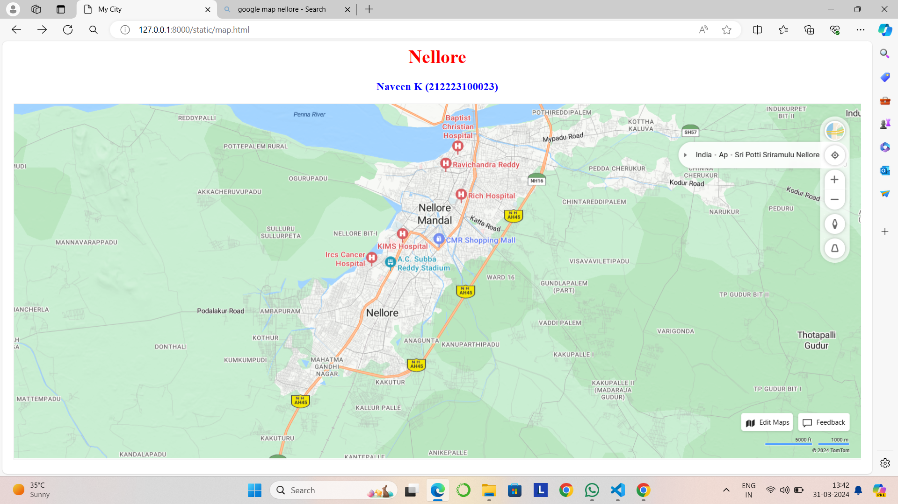
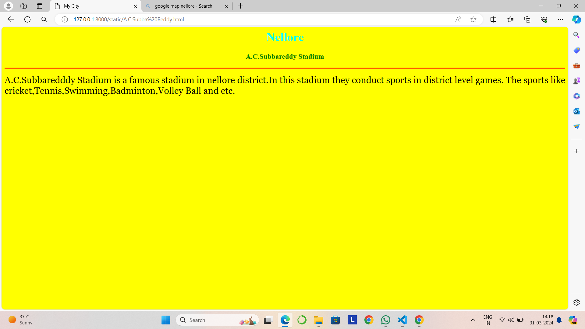
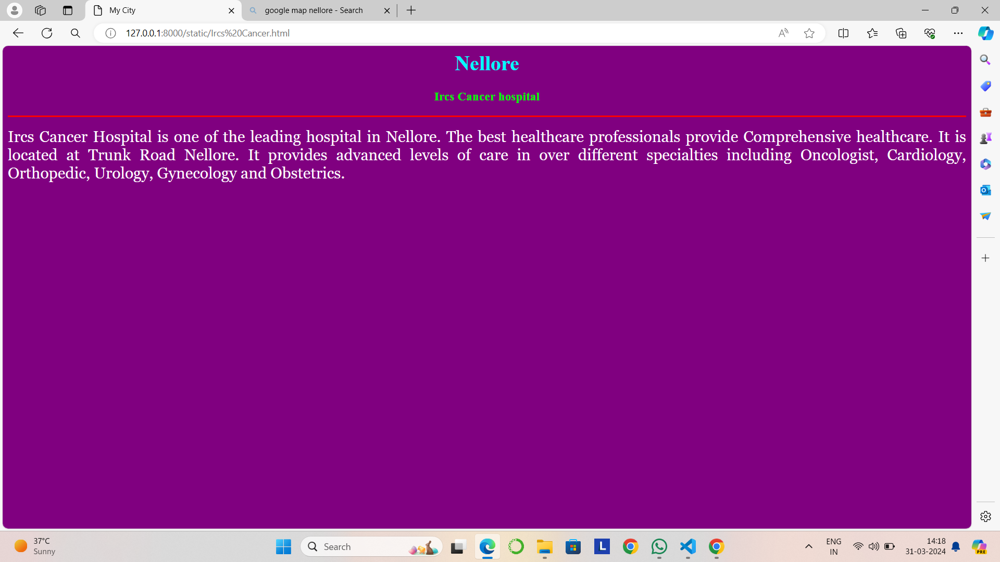
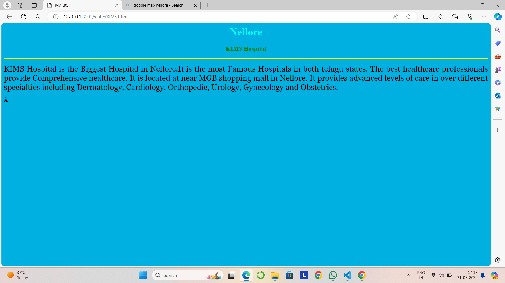
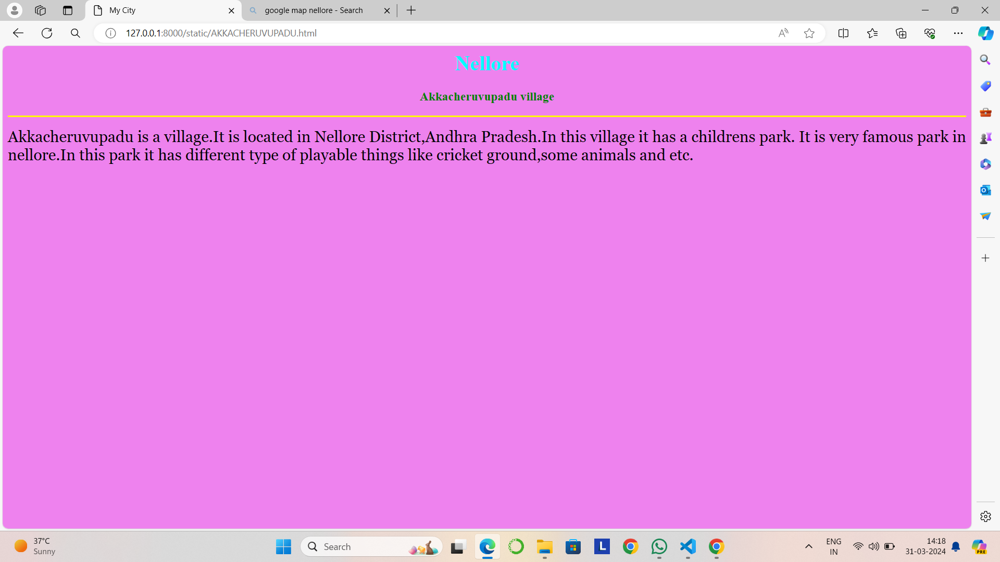
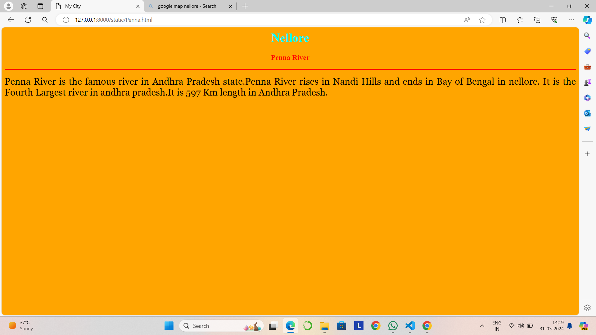

# Ex04 Places Around Me
## Date:  31.03.2024

## AIM
To develop a website to display details about the places around my house.

## DESIGN STEPS

### STEP 1
Create a Django admin interface.

### STEP 2
Download your city map from Google.

### STEP 3
Using ```<map>``` tag name the map.

### STEP 4
Create clickable regions in the image using ```<area>``` tag.

### STEP 5
Write HTML programs for all the regions identified.

### STEP 6
Execute the programs and publish them.

## CODE
```
map.html

<html>
    <head>
        <title>My City</title>
    </head>
    <body>
        <h1 align="center">
            <font color="red"><b>Nellore</b></font>
        </h1>
        <h3 align="center">
            <font color="blue"><b>Naveen K (212223100023)</b></font>
        </h3>
        <center>
            
            <map name="MyCity">
                <area target="" alt="Hospital" title="Hospital" href="KIMS.html" coords="698,365,913,496" shape="rect">
                <area target="" alt="village" title="village" href="AKKACHERUVUPADU.html" coords="250,360,220,100" shape="circle">
                <area target="" alt="Stadium" title="Stadium" href="A.C.Subba Reddy.html" coords="700,250,600,300" shape="rect">
                <area target="" alt="Hospital" title="Hospital" href="Ircs Cancer.html" coords="580,300,50,50" shape="circle">
                <area target="" alt="River" title="River" href="Penna.html" coords="60,60,150,150" shape="rect">
                <area target="" alt="" title="" href="" coords="" shape="0">
    
            </map>
        </center>  
    </body>
</html>


A.C.Subba Reddy.html

<html>
    <head>
        <title>My City</title>
    </head>
    <body bgcolor="yellow">
        <h1 align="center">
            <font color="cyan"><b>Nellore</b></font>
        </h1>
        <h3 align="center">
            <font color="green"><b>A.C.Subbareddy Stadium</b></font>
        </h3>
        <hr size="3" color="red">
        <p align="justify">
            <font face="Georgia" size="5" color="black">
                A.C.Subbaredddy Stadium is a famous stadium in nellore district.In this stadium they conduct sports in district level games.
                The sports like cricket,Tennis,Swimming,Badminton,Volley Ball and etc.
            </font>
        </p>
    </body>
</html>


Ircs Cancer.html

<html>
    <head>
        <title>My City</title>
    </head>
    <body bgcolor="purple">
        <h1 align="center">
            <font color="cyan"><b>Nellore</b></font>
        </h1>
        <h3 align="center">
            <font color="lime"><b>Ircs Cancer hospital</b></font>
        </h3>
        <hr size="3" color="red">
        <p align="justify">
            <font face="Georgia" size="5" color="white">
                Ircs Cancer Hospital is one of the leading hospital in Nellore. 
                The best healthcare professionals provide Comprehensive healthcare. 
                It is located at Trunk Road Nellore. 
                It provides advanced levels of care in over different specialties including Oncologist, Cardiology, Orthopedic, Urology, Gynecology and Obstetrics.
            </font>
        </p>
    </body>
</html>


KIMs.html

<html>
    <head>
        <title>My City</title>
    </head>
    <body bgcolor="sky blue">
        <h1 align="center">
            <font color="cyan"><b>Nellore</b></font>
        </h1>
        <h3 align="center">
            <font color="green"><b>KIMS Hospital</b></font>
        </h3>
        <hr size="3" color="yellow">
        <p align="justify">
            <font face="Georgia" size="5" color="black">
                KIMS Hospital is the Biggest Hospital in Nellore.It is the most Famous Hospitals in both telugu states. 
                The best healthcare professionals provide Comprehensive healthcare. 
                It is located at near MGB shopping mall in Nellore. 
                It provides advanced levels of care in over different specialties including Dermatology, Cardiology, Orthopedic, Urology, Gynecology and Obstetrics.
 
            </font>
        </p>
    </body>
</html>

AKKACHERUVUPADU.html

<html>
    <head>
        <title>My City</title>
    </head>
    <body bgcolor="violet">
        <h1 align="center">
            <font color="cyan"><b>Nellore</b></font>
        </h1>
        <h3 align="center">
            <font color="green"><b>Akkacheruvupadu village</b></font>
        </h3>
        <hr size="3" color="yellow">
        <p align="justify">
            <font face="Georgia" size="5" color="black">
                Akkacheruvupadu is a village.It is located in Nellore District,Andhra Pradesh.In this village it has a childrens park.
                It is very famous park in nellore.In this park it has different type of playable things like cricket ground,some animals and etc.
            </font>
        </p>
    </body>
</html>


Penna.html

<html>
    <head>
        <title>My City</title>
    </head>
    <body bgcolor="orange">
        <h1 align="center">
            <font color="cyan"><b>Nellore</b></font>
        </h1>
        <h3 align="center">
            <font color="red"><b>Penna River</b></font>
        </h3>
        <hr size="3" color="red">
        <p align="justify">
            <font face="Georgia" size="5" color="black">
                Penna River is the famous river in Andhra Pradesh state.Penna River rises in Nandi Hills and ends in Bay of Bengal in nellore.
                It is the Fourth Largest river in andhra pradesh.It is 597 Km length in Andhra Pradesh.
            </font>
        </p>
    </body>
</html>


```

## OUTPUT







## RESULT
The program for implementing image maps using HTML is executed successfully.
